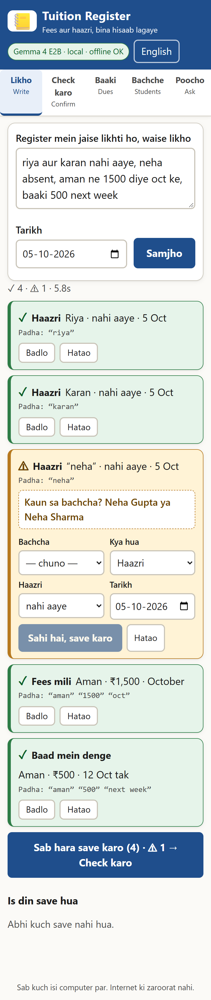
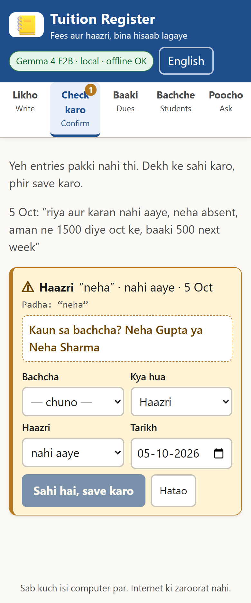
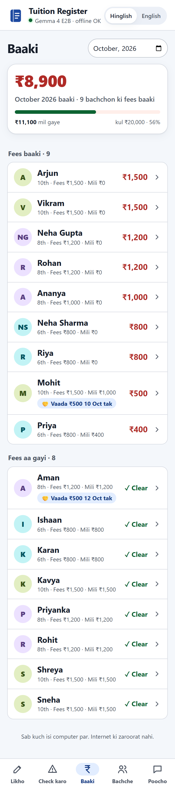

# Tuition Register

A tuition fee and attendance register my mom can write to like a notebook. She types a line the way she'd write it in her paper register (`riya nahi aayi, aman ne 1500 diye oct ke, baaki 500 next week`). A **local Gemma model (Ollama)** copies out the names, amounts and months as exact spans. **Code** turns them into numbers and dates, checks everything (rules V1 to V8), and does all the money maths. Anything it can't confirm goes to a **Confirm tray** instead of being saved. Runs fully offline.

Built Oct 5, 2026. Powered by **Gemma 4 (E2B)**, an open-weight model, running locally.

> **All data in this repo is synthetic.** The 18-student roster and the 60 test lines were written by me in the style of a home-tuition register. No real children's names or payments. Mom hasn't used it yet.

| Write | Confirm tray | Dues + reminder |
|---|---|---|
|  |  |  |

## Results (60 synthetic lines, Wi-Fi off)

| Model | Fact precision | Fact recall | Silent errors, no checker | Silent errors, with checker | Sent to Confirm tray | p50 latency |
|---|---:|---:|---:|---:|---:|---:|
| Gemma 4 E2B (default) | 94% | 94% | 7 of 79 | 2 | 7 facts (9%) | 3.3 s |
| Gemma 3 1B | 56% | 52% | 34 of 73 | 4 | 42 facts (58%) + 7 "missed?" | 3.0 s |

Full tables, definitions and every miss: [`eval/results/results.md`](eval/results/results.md). It's a sanity check on lines I wrote, not a benchmark.

## How it works

- **Model reads, code counts.** The model (JSON-schema output, `temperature 0`, `think: false`) returns only verbatim spans: `student_text`, `amount_text`, `month_text`, `date_text`. It never outputs a number or a resolved date.
- `app/amounts.py` reads `1,500`, `1.5k`, `15 sau`, `dedh hazaar`. `app/dates.py` resolves `oct`, `pichle mahine`, `next week`, `12 ko`, and `kal` (past for payments, future for promises). `app/names.py` matches nicknames with rapidfuzz.
- `app/verifier.py`: V1 span really is in the line, V2 amount parses, V3 amount is sane, V4 exactly one student matches, V5 month/date resolves, V6 required fields, **V7 coverage** (a student named in the line but missing from every event gets a "missed?" card), V8 duplicate today.
- `app/ledger.py`: dues per month, payments to the named month first, otherwise the oldest unpaid month, overflow as advance, promises tracked separately.
- Reminders: the model writes a tone template with `{name}`, `{amount}`, `{month}` and no digits. Code validates it (falls back to a built-in one) and fills the numbers. Ask: the model picks one of 4 intents, code answers.

## Setup (Windows / PowerShell)

```powershell
# 1. Ollama (https://ollama.com), then:
ollama pull gemma4:e2b        # 4.6 GB, default
ollama pull gemma3:1b         # optional, 815 MB

# 2. App
git clone https://github.com/rahultapase/hacktoberfest-gemma-challenge.git
cd hacktoberfest-gemma-challenge
python -m venv .venv
.\.venv\Scripts\python.exe -m pip install -r requirements.txt
.\.venv\Scripts\python.exe -m app.main            # http://127.0.0.1:8000
```

Options: `--model gemma3:1b`, `--roster path.csv` (or `TR_ROSTER`; default is the synthetic `eval/demo_roster.csv`), `--db path` (default `data/private/register.db`, gitignored).

Tests: `.\.venv\Scripts\python.exe -m pytest -q` (137 tests, no model needed). Eval: `.\.venv\Scripts\python.exe eval/run_eval.py --models gemma4:e2b gemma3:1b`. UI flow + screenshots: `node tools/ui_flow.mjs docs/images` (headless Chrome).

## Privacy and security

- Binds to `127.0.0.1` by default. The only network call is to Ollama on `localhost:11434`. No telemetry.
- `--lan` listens on `0.0.0.0` so a phone on home Wi-Fi can connect. It prints a warning. Set `TR_PIN` for a simple shared PIN on every API call. **That is not real authentication: use it only on a trusted home network.**
- Parameterized SQL only, Pydantic input validation, strict CSP, all text rendered with `textContent`.
- Accessibility: semantic HTML, real labels, keyboard tabs, `aria-live` results, colour plus icon. Not audited with assistive tech; no compliance claim.

## Limitations

- Test set is small and synthetic. Real handwriting-style notes will be messier.
- `kal` is ambiguous: a future absence ("kal nahi aayega") gets saved as yesterday (eval line #55).
- E2B sometimes drops a month phrase ("is mahine ke"), and the payment then goes to the oldest unpaid month (eval line #15).
- Hindi in Devanagari script for input: not tested.
- No voice input. Not yet used by Mom.

## Credits

Gemma models by Google DeepMind, served by Ollama. FastAPI, Uvicorn, RapidFuzz, httpx, psutil, pytest. Built with help from an AI coding agent (Kiro); I made the calls on scope, rules and tests.

## Timeline note

Repo created and first version finished on Oct 5, 2026 (by 12:29 PM IST). Changes after that:

- Oct 9, 2026: README wording only. No code, test or data changes.

MIT License.
